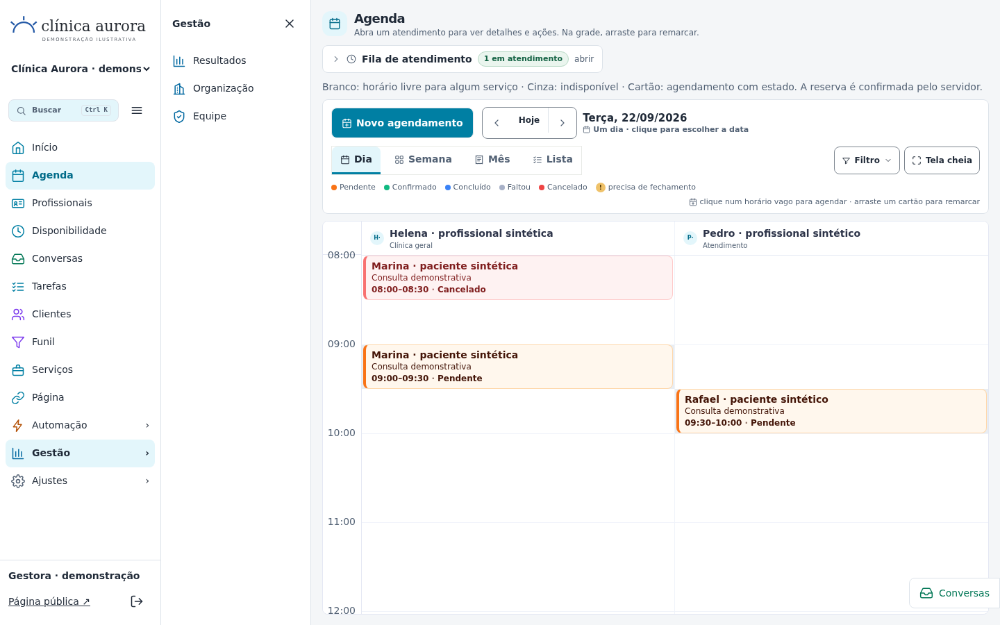

# Correção de direção — implementação e evidências

Data: 21/09/2026. Branch: `arena/01a0bfbf-instalink`. PR: [#33](https://github.com/HernaniFigueira/instalink/pull/33), sem merge.

Esta rodada substitui a direção visual anterior apenas no painel. Preserva as entregas funcionais anteriores. Landing, login e página pública **não foram redesenhados novamente**. Nenhum ambiente de produção foi acessado ou publicado; nenhuma exclusão de registro real foi executada.

## Cinco entregas

1. **Menu:** 232 px, expandido por padrão; recolhimento explícito. Somente Automação, Gestão e Ajustes abrem a coluna branca de 216 px, que desloca o conteúdo. Um grupo por vez; links diretos e voltar/avançar sincronizam o grupo. Abaixo de 1200 px, menu único com Voltar e acesso à conta. Logo sem moldura, recorte ou alteração do arquivo original. Rotas e autorização existentes preservadas.
2. **Paleta, abas, agenda e fila:** tokens solicitados no escopo `.il-platform`, sem afetar temas públicos. Abas com indicador inferior de 3 px. Eventos comuns agora exibem nome em 14 px e metadados legíveis, com colunas mínimas e rolagem interna. A indicação de horário livre reutiliza `computeSlots` — não há outro motor nem autorização para reservar pelo estado visual. Falha na leitura de agendamentos mostra erro, não uma grade aparentemente livre. A fila de chegada permanece operacional: 280 px a partir de 1280 px; Drawer nas larguras menores.
3. **Conversas:** mesma implementação compartilhada entre página e painel lateral. Painel de até 960 px/85 vw, animação de 180 ms, fundo bloqueante sem blur, Escape, contenção/retorno de foco e reduced motion. Rascunhos permanecem em memória ao fechar/reabrir. Histórico desconectado continua consultável, com envio bloqueado e aviso verdadeiro. A contenção de foco também recupera o foco quando o carregamento assíncrono substitui um controle.
4. **Organização:** contexto consolidado explícito, período preservado inclusive ao trocar organização e somente filiais autorizadas. Financeiro é omitido no servidor quando não autorizado. Cadastros não são chamados de pacientes únicos. Para profissional restrito, o novo consolidado não expõe uma contagem ampla de CRM: esse agregado fica indisponível enquanto não existe projeção reutilizável segura. Abrir filial/agenda exige um ID concreto; não existe unidade “todas” para escrita.
5. **Exclusão protegida:** ações separadas para filial e organização, impacto calculado no servidor, nome exato e senha atual. Autorização de 120 segundos, vinculada a usuário, sessão, tipo, alvo, organização, nome e ação de exclusão; token armazenado como hash e consumido uma única vez. Verificação e exclusão na mesma transação. Proteção de origem/header, limite persistido de tentativas de senha, auditoria sem segredos e revalidação de propriedade/dependências. Criar filial também revalida a organização dentro da transação, evitando recriar vínculo com organização já excluída.

### Modelo e limite de exclusão

O modelo usa `Organization.ownerId` e `Business.organizationId/ownerId`, além de membros e dependências por unidade. Não foi criada uma operação de desvinculação. Nesta entrega, excluir é reservado ao proprietário direto; administrador não proprietário e Master são recusados.

Pacientes, agendamentos, atendimentos, fila, catálogo, disponibilidade, financeiro, integrações, mensagens, membros e demais dependências impedem exclusão. Organização com filial ou vínculo não é removida. Não há cascata de histórico. Somente uma página inicial comprovadamente padrão, não editada e não publicada pode acompanhar a exclusão de uma filial vazia; a comparação inclui tema e conteúdo, não apenas timestamp. Auditoria é preservada.

**O modelo não tem um marcador “entidade de teste”.** A elegibilidade implementada é vazio/sem dependências + propriedade + reautenticação. Todas as exclusões executadas nesta entrega foram de alvos sintéticos em bancos locais isolados. Isso não constitui autorização ou execução de exclusões em produção.

## Validação executada

| Verificação | Resultado |
|---|---|
| `npm run typecheck` | Aprovado |
| `npm run build`, sem ambiente de produção, banco isolado | Aprovado |
| Vitest completo, 99 arquivos | **1746 aprovados / 5 falhas preexistentes reproduzidas** |
| Segurança da exclusão, rotas autenticadas reais | **46/46 aprovados** |
| Projeção da organização | **6/6 aprovados** |
| Playwright integral da rodada final | **27/29 aprovados**; duas falhas de sincronização/seletores nos testes novos |
| Reexecução das duas verificações após corrigir os testes | **2/2 aprovados**; inclui troca de organização com período personalizado e erro da agenda |
| Rodada integral anterior, antes dessas duas verificações adicionais/ajustadas | **28/28 aprovados** |

Assim, os **29 cenários distintos** têm execução aprovada; o log integral com as duas falhas dos testes e o log de reexecução estão preservados, não substituídos por uma alegação de rodada única verde.

### Cobertura do navegador

- 1440, 1280, 1024 e 390 px: menu, coluna secundária, recolhimento explícito, versão móvel, ausência de overflow da página, agenda, fila, conversas e organização.
- Grupo substitui/fecha grupo, rota direta, voltar/avançar; troca de unidade mantém data/modo pertinentes e remove IDs/filtros de outra unidade.
- Conversas: foco inicial, Shift+Tab, Escape, retorno de foco, reduced motion, rascunho após reabrir, etapas móveis, envio desabilitado sem canal.
- Organização: contexto concreto, payload sem financeiro para secretaria, filial alheia ausente, falha não representada como zero, manutenção de período personalizado.
- Exclusão: bloqueio por dependências sem campo de senha; senha incorreta; campo de senha limpo; exclusão autenticada de filial sintética vazia e depois da organização sintética vazia; alvo excluído deixa de ser acessível.
- Regressões: agenda/lista/detalhe, paciente cadastrado e novo, fila com início de atendimento, prontuário, impressão real em PDF com mais de uma página e sem nota interna, editor/preview/salvamento publicado, login do paciente, confirmação persistida, conflito 409, reagendamento/cancelamento e estados de falha. As telas públicas foram **testadas**, não redesenhadas nesta rodada.

### Cobertura de segurança complementar

Os testes de rota verificam: senha real em vez de booleano do frontend; cinco tentativas e bloqueio de 15 minutos; origem/protocolo/header inválidos; não proprietário; Master; alvo de outra organização; troca de alvo/sessão/tipo/nome; expiração; token sem sessão; dependência e propriedade alteradas após autorizar; chamadas DELETE simultâneas com exatamente uma exclusão e um evento de auditoria; página personalizada; ausência de senha/token na auditoria; inventário de dependências, inclusive coleção futura com referência à unidade.

### Falhas do baseline — não escondidas

Comparação executada com arquivo de trabalho de `155cbbf`, o HEAD anterior do PR, fora do checkout e sem mudar de branch:

- 3 falhas de Instagram: entrega pendente, resposta do inbox e mensagem no limite exato.
- 1 falha de poda de automações: `waiting` versus `failed`.
- 1 falha no fluxo de agendamento por webhook WhatsApp, também reproduzida no baseline na rodada final. O cenário usa dia/horário reais; não foi alterado para forçar aprovação.

As 15 antigas assertivas de fonte que apontavam para o inbox antes da extração ou para o layout substituído foram atualizadas. As assertivas de domínio desses cinco testes não foram modificadas.

Logs: [Vitest](evidence/direction/vitest-summary.txt), [baseline inicial](evidence/direction/baseline-original-summary.txt), [baseline WhatsApp](evidence/direction/baseline-whatsapp-summary.txt), [navegador integral](evidence/direction/browser-full.txt), [reexecução](evidence/direction/browser-recheck.txt).

## Capturas reais

Capturas do Chromium 153, com sandbox habilitado, aplicação compilada e dados sintéticos persistidos. Sem imagens geradas ou telas montadas para simular aprovação.

| Largura | Menu | Agenda | Fila | Conversas | Organização |
|---|---|---|---|---|---|
| 1440 | [abrir](evidence/direction/menu-1440.png) | [abrir](evidence/direction/agenda-1440.png) | [abrir](evidence/direction/queue-1440.png) | [abrir](evidence/direction/conversations-1440.png) | [abrir](evidence/direction/organization-1440.png) |
| 1280 | [abrir](evidence/direction/menu-1280.png) | [abrir](evidence/direction/agenda-1280.png) | [abrir](evidence/direction/queue-1280.png) | [abrir](evidence/direction/conversations-1280.png) | [abrir](evidence/direction/organization-1280.png) |
| 1024 | [abrir](evidence/direction/menu-1024.png) | [abrir](evidence/direction/agenda-1024.png) | [abrir](evidence/direction/queue-1024.png) | [abrir](evidence/direction/conversations-1024.png) | [abrir](evidence/direction/organization-1024.png) |
| 390 | [abrir](evidence/direction/menu-390.png) | [abrir](evidence/direction/agenda-390.png) | [abrir](evidence/direction/queue-390.png) | [abrir](evidence/direction/conversations-390.png) | [abrir](evidence/direction/organization-390.png) |

Adicionais: [dependências bloqueiam exclusão](evidence/direction/deletion-blocked.png), [senha recusada](evidence/direction/deletion-password-rejected.png), [organização com falha](evidence/direction/organization-error.png), [agenda com falha](evidence/direction/agenda-load-error.png), [reduced motion](evidence/direction/conversations-reduced-motion.png).

## Limites e revisão pendente

- As falhas de domínio preexistentes continuam abertas; não há homologação de Meta/WhatsApp/Instagram nem envio externo real nesta entrega.
- Os apontamentos D0 anteriores de permissões de páginas/organizações e CRM intrafilial continuam registrados; não se declara essa auditoria global resolvida. O novo consolidado usa projeção explícita e não envia financeiro proibido.
- Blocos muito curtos ou sobrepostos preservam a geometria temporal existente; nem todos os campos cabem simultaneamente nesses blocos. Rótulo acessível, Lista e detalhe continuam disponíveis. Não houve alteração de duração/regra de reserva para obter altura visual.
- A indicação visual de horário livre é informativa e depende do catálogo/agendamentos carregados. Com limite de 500 registros, não é calculada como se a leitura estivesse completa; toda reserva e movimentação continuam validadas no servidor.
- Testes de navegador executados em Chromium/Linux. Não constituem homologação de todos os browsers, leitores de tela ou dispositivos físicos.
- A prévia é local/isolada na porta 3000, via **LIVE PREVIEW** autorizado da Arena. Não foi removida a proteção de tráfego da plataforma nem publicada uma URL pública sem autenticação.

## Reprodução segura

1. Usar um banco novo em `~/.cache/`, sem `DATABASE_URL` nem credenciais de provedores. Compilar/iniciar a aplicação apontando `INSTALINK_DB_FILE` para esse banco. O servidor deve escutar `0.0.0.0:3000`.
2. Executar `DESIGN_TEST_FIXTURE=~/.cache/.../fixture.json npm run test:360:setup` contra esse servidor local. O setup recusa duplicar um arquivo de fixture existente.
3. Parar o servidor. Executar `tests/360/direction-history-setup.mjs` com `INSTALINK_DB_FILE` e `DESIGN_TEST_FIXTURE` apontando para os mesmos arquivos. Esse script recusa banco fora de `~/.cache/`, `DATABASE_URL`, fixture não sintética e servidor ainda ativo na porta 3000. Ele cria somente histórico desconectado, não uma integração fictícia.
4. Reiniciar o mesmo servidor e executar `npm run test:360:browser` com `DESIGN_TEST_FIXTURE` e um Chromium disponível em `D1A_BROWSER_EXECUTABLE`. Manter `chromiumSandbox: true`; não usar bypass de TLS/autenticação/sandbox.
5. `npm test` e `npm run typecheck`. Testes de rotas usam banco temporário próprio. A suíte operacional muta a fixture sintética; para repetir a rodada integral, preparar outro banco/fixture novos em vez de executar contra dados reais.

Fixtures, sessões, senhas de teste e bancos ficam fora do Git. Evidências publicadas contêm apenas dados sintéticos.
