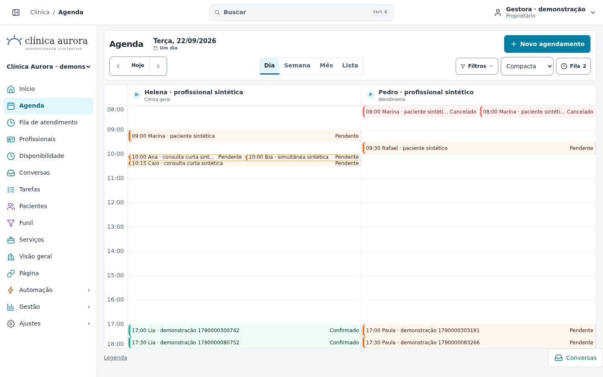

# Correção prioritária — login, cabeçalho e agenda

Revisão de 21/09/2026 · branch `arena/01a0bfbf-instalink` · [PR #33](https://github.com/HernaniFigueira/instalink/pull/33).

## Login: correção local, incidente externo ainda não diagnosticado

O texto relatado vinha do catch HTTP 500 do login, não da resposta de credencial inválida. Corrigidos o tratamento de respostas não JSON, a distinção entre 401/429/indisponibilidade/rede e o diagnóstico incorreto de persistência quando `/me` falhava. Falhas internas agora têm correlação segura, sem serializar dados sensíveis. Commit exclusivo: `516626b`.

**Não há comprovação de recuperação do login em produção.** Faltam hostname afetado, horário/fuso, status das requisições de login e `/me`, identificador da requisição/deployment e logs de runtime autorizados e sanitizados. Não compartilhar senha, cookie, token, corpo da requisição, variáveis ou dados de pacientes. Metadados de deployment não são logs de runtime. [Investigação detalhada](LOGIN-INCIDENT-2026-09-21.md).

## Acabamento implementado, em commit separado

- Cabeçalho branco de 60px, breadcrumb, busca única centralizada no desktop (máximo 440px), conta única com nome/papel real. Nenhuma notificação fictícia. Busca/conta removidas da lateral; seletor de unidade preservado.
- Menu expandido com ícones coloridos e nomes; Agenda, Fila, Pacientes, Conversas e Visão geral diretos. Somente Automação/Gestão/Ajustes abrem coluna adjacente. Controles `Recolher menu`/`Expandir menu` com ícones de painel; hamburger no mobile.
- Agenda com duas linhas no desktop, data e ação principal, navegação temporal, quatro modos, filtros, densidade e contagem real da fila. Sem introdução permanente ou tela cheia. Mobile reorganizado, data legível e sem rolagem horizontal da página.
- Compacta padrão, persistida por usuário/navegador; escala ajustada à altura útil, mínimo 40px/h. Confortável: 72px/h. Sem zoom, duração artificial ou alteração do motor de reservas.
- Intervalo da grade considera expediente, exceções e eventos carregados dos dias visíveis, inclusive fora do expediente. Leitura do catálogo aceita janela histórica mantendo os guards. A agenda consome todas as páginas autorizadas da API existente, sem elevar o limite de 500 por página; falha de página, total alterado ou contagem final incompatível não são apresentados como agenda completa. Resultados de cargas antigas são descartados.
- Blocos curtos mantêm altura proporcional, resumo com estado textual, rótulo acessível e detalhe por clique/Enter. Resumo completo no rodapé ao focar/apontar. Legenda discreta no rodapé.
- Fila fechada por padrão, escolha persistida por usuário/unidade. Rail de 280px em desktop largo, painel acessível nas larguras menores. Ordem/operações de atendimento preservadas.
- Fundo sólido `#F4F6F8`, superfícies brancas, textos escuros, bordas discretas, sem novo tema público ou modo escuro.

## Validação executada

Tudo abaixo foi executado com dados sintéticos isolados, sem conexão ou alteração de produção.

| Verificação | Resultado |
| --- | --- |
| `npm run typecheck` | Aprovado |
| `npm run build`, ambiente isolado | Aprovado |
| `npm run test:360:browser`, contra `next start` do build final | **34/34 aprovados**, 52,1s |
| Subconjunto prioritário incluído acima | **5/5 aprovados** |
| `npm test` completo | **1.769 aprovados / 6 falhas**, 104 arquivos, 1.775 testes |
| Reprodução das quatro suítes afetadas no baseline `353d31a` | **143 aprovados / as mesmas 6 falhas** |
| `git diff --check` | Aprovado |

Os testes de navegador verificam sessão real/reload, 401, 429, HTML 502, JSON 503, rede e falha de `/me`; cabeçalho sem duplicatas; 1440×900, 1366×768 e 390×844; expediente 08–18; proporção de 15 minutos; simultâneos/adjacentes; exceção e eventos fora de horário; uma rolagem vertical de grade quando necessária; densidade persistida; fila, filtros, troca de unidade; foco/teclado; ausência de erros JavaScript capturados. Em 1440×900, 08–18 cabe sem rolagem vertical da grade. As jornadas anteriores também passaram: público/editor, pacientes, atendimento, permissões e exclusão protegida de alvos sintéticos vazios. Há cobertura adicional de layout 320px.

As seis falhas não foram mascaradas nem corrigidas alterando regras de domínio:

- `a34-instagram.test.ts`: envio outbound, resposta por canal da conversa, limite exato de texto (3).
- `automation-audit-p4.test.ts`: preservação de execução waiting durante poda (1).
- `pipeline.test.ts`: conversão para horário que já passou (1).
- `whatsapp-robustness.test.ts`: booking no webhook (1).

Reprodução feita em checkout arquivado de `353d31a`, sem trocar a branch de trabalho. Testes antigos de contratos visuais foram atualizados exclusivamente para os requisitos novos; testes de domínio não foram relaxados.

## Capturas reais do build final

Todas são screenshots do navegador, com dados sintéticos; não são imagens geradas nem evidência de produção. A contagem da fila reflete o estado real da fixture após as jornadas operacionais.

| Cenário | Captura |
| --- | --- |
| Compacta 1440×900 | [Abrir](evidence/priority/compact-1440.png) |
| Compacta 1366×768 | [Abrir](evidence/priority/compact-1366.png) |
| Compacta 390×844 | [Abrir](evidence/priority/compact-390.png) |
| Confortável 1366×768 | [Abrir](evidence/priority/comfortable-1366.png) |
| Fila lateral 1440×900 | [Abrir](evidence/priority/queue-1440.png) |
| Fila lateral 1366×768 | [Abrir](evidence/priority/queue-1366.png) |
| Fila mobile | [Abrir](evidence/priority/queue-390.png) |
| Fora do expediente, grade rolada até evento tardio | [Abrir](evidence/priority/out-of-hours-1366.png) |
| Limite 429 simulado | [Abrir](evidence/priority/login-429.png) |
| Indisponibilidade HTML 502 simulada | [Abrir](evidence/priority/login-502.png) |
| Indisponibilidade JSON 503 simulada | [Abrir](evidence/priority/login-503.png) |

## Limites preservados

- Não houve merge, rollback, deploy de produção, redefinição de senha, seed/banco recriado em produção ou flexibilização de autenticação.
- Não há promessa de que qualquer expediente ou quantidade de profissionais/eventos caiba sem rolagem. Em mobile, a grade pode rolar horizontalmente por dentro; a página não. Blocos curtos não comportam todos os campos ao mesmo tempo; detalhe/Lista e descrição acessível permanecem disponíveis.
- A leitura paginada não é uma transação de snapshot entre requisições. As inconsistências detectáveis são recusadas; disponibilidade e toda escrita continuam validadas pelo servidor.
- Indicações de livre/indisponível são informativas; em agendas extensas permanece o fallback conservador de disponibilidade no formulário.
- Chromium/Linux foi testado; não se declara homologação universal de browsers, leitores de tela ou dispositivos. Contraste visual foi inspecionado; não se declara auditoria WCAG integral.
- Limites D0 anteriores, CRM intrafilial e integrações externas Meta/WhatsApp/Instagram continuam registrados; nenhuma homologação externa foi presumida.
- Preview local: **LIVE PREVIEW “InstaLink — revisão isolada”**, porta 3000, build otimizado e banco sintético. A proteção de tráfego da Arena não foi desativada. O link do deployment Vercel, quando registrado no PR, é metadado e não prova login/sessão no ambiente remoto.

## Reprodução segura

1. Seguir a [preparação sintética anterior](DIRECTION-CORRECTION.md#reprodução-segura), com banco e fixture novos em `~/.cache/`, sem `DATABASE_URL`/credenciais de provedores.
2. Depois do setup local e com servidor parado, executar também `node tests/360/priority-setup.mjs`, fornecendo `INSTALINK_DB_FILE` e `DESIGN_TEST_FIXTURE`. O script recusa produção, caminhos fora do cache, fixture não sintética e porta 3000 ativa.
3. Build/start apontando para esse banco; executar `npm run test:360:browser` com a fixture e Chromium disponível. Manter sandbox/TLS/autenticação intactos. As jornadas modificam somente a fixture sintética.
4. Executar `npm test` e `npm run typecheck`. Os arquivos de banco, fixtures, sessões, senhas e logs brutos permanecem fora do Git.
